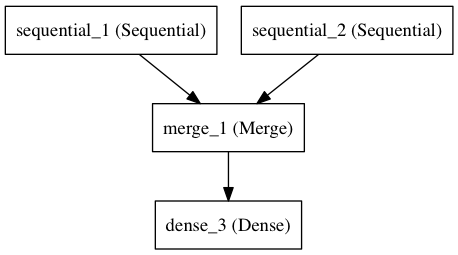

## Getting started with the Keras Sequential model
Sequential modelは層を積み重ねて作る.
Sequentialのコンストラクタに層のインスタンスを与えることでSequentialを作ることができる.下の`Dense`,`Activation`が与えられる層(ちなみにDenseはいわゆるFull connectedなNeural Network).
```
from Keras.models import Sequential
model = Sequential([
	Dense(32, input_dim=784),
	Activation('relu'),
	Dense(10),
	Activation('softmax'),
])
```
また,`.add()`メソッドを使って層を追加することもできる.
```
model = Sequential()
model.add(Dense(32, input_dim=784))
model.add(Activation('relu'))
```

### Specifying the input shape
モデルはインプットの次元数でどんなものが来るのかわからないといけない.
そのためSequential modelの最初の層にはインプット次元の情報を与える必要がある（それ以外の層は自動的に次元数を推論できる）.
これを行うために３つの方法がある.

1. input_shape引数に渡す.tupleで渡す.整数ではなくてNoneで渡すと正の数ならなんでもよいと解釈される.バッチサイズは含まれていない.
2. batch_input_shape引数で渡す.これはバッチサイズが含まれている.バッチサイズを固定したい時に有効な手法となる.
3. Denseなどの二次元の層はinput_dim引数で次元数を指定できる.三次元の層ではinput_dim引数の他にinput_length引数を指定する.

これらをコードに落とし込んだのが以下である.

1. 
```
	model = Sequential()
	model.add(Dense(32, input_shape=(784,)))
```
2. 
```
	model = Sequential()
	model.add(Dense(32, batch_input_shape=(None, 784)))
	# note that batch dimension is "None" here,(バッチサイズがNoneになっているが)
	# so the model will be able to process batches of any size(これでバッチサイズがどんなものでも学習できる)
```
3. 
```
	model = Sequential()
	model.add(Dense(32, input_dim=784))
```

そして次の３つも同様の意味を持つコードとなる.

1. 
```
	model = Sequential()
	model.add(LSTM(32, input_shape=(10, 64)))
```
2. 
```
	model = Sequential()
	model.add(LSTM(32, batch_input_shape=(None, 10, 64)))
```
3. 
```
	model = Sequential()
	model.add(LSTM(32, input_length=10, input_dim=64))
```

### The Merge layer
幾つかのSequentialのインスタンスを統合し,１つのアウトプットを出力するようにすることができる.
出力のSequentialは新たなSequentialに層として積み重ねることができる.
以下が実例と,層の概念図である.
```
from keras.layers import Merge

left_branch = Sequential()
left_branch.add(Dense(32, input_dim=784))

right_branch = Sequential()
right_branch.add(Dense(32, input_dim=784))

merged = Merge([left_branch, right_branch], mode='concat')

final_model = Sequential()
final_model.add(merged)
final_model.add(Dense(10, activation='softmax'))
```


Mergeはいくつかのmodeが用意されていて,２つのテンソルのMergeの仕方を記述できる.
+ `sum`(default): 要素毎に足し合わせる.
+ `concat`: テンソルを連結する.連結する次元を`concat_axis`引数で指定する.
+ `mul`: 要素毎に掛け合わせる.
+ `ave`: テンソルの平均.
+ `dot`: 内積.どの次元に対して内積をとるか`dot_axes`引数で指定する.
+ `cos`: 二次元テンソルに対してcosine proximityをとる.

mode引数にはlambda式などを使って任意の計算式を記述できる.
```
merged = Merge([left_branch, right_branch], mode=lambda x, y: x - y)
```
SequentialとMergeで表すことのできない複雑なモデルを構築する場合は[the function API](http://keras.io/getting-started/functional-api-guide)を参照する必要がある.

### Compilation
モデルを学習させる前に学習プロセスの設定を行う必要がある.
`compile`メソッドによっておこなわれる.`compile`メソッドは以下の３つの引数をとる.
+ 最適化手法.`optimizer`引数.`rmsprop`や`adagrad`など`Optimizer`classのインスタンスを指定する.[optimizers](http://keras.io/optimizers)参照.
+ 損失関数.modelはこの関数を最小化するように学習する.[objectives](http://keras.io/objectives)参照.
+ 精度(metrics).分類タスクにおいて`metrics=['accuracy']`として精度を計算する.現状`accuracy`のみ実装されている.


```
# for a multi-class classification problem
model.compile(optimizer='rmsprop',
			  loss='categorical_crossentropy',
			  metrics=['accuracy'])

# for a binary classification problem
model.compile(optimizer='rmsprop',
			  loss='binary_crossentropy',
			  metrics=['accuracy'])

# for a mean squared error regression problem
model.compile(optimizer='rmsprop',
			  loss='mse')
```

### Training
KerasではNumpy配列のインプットとラベルで学習が行われる.
学習フェーズでは`fit`関数がよく使われる.

```
# for a single-input model with 2 classes(binary):(二クラス分類)

model = Sequential()
model.add(Dense(1, input_dim=784, activation='softmax'))
model.compile(optimizer='rmsprop',
			  loss='binary_crossentropy',
			  metrics=['accuracy'])

# generate dummy data(適当なインプットデータを作る)
import numpy as np
data = np.random.random((1000, 784))
labels = np.random.randint(2, size=(1000, 1))

# train the model, interating on the data in batches(バッチサイズ３２で学習を行う)
# of 32 samples
model.fit(data, labels, nb_epoch=10, batch_size=32)
```

```
# for a multi-input model with 10 classes:(１０クラス分類)

left_branch = Sequential()
left_branch.add(Dense(32, input_dim=784))

right_branch = Sequential()
right_branch.add(Dense(32, input_dim=784))

merged = Merge([left_branch, right_branch], mode='concat')

model = Sequential()
model.add(merged)
model.add(Dense(10, activation='softmax'))

model.compile(optimizer='rmsprop',
			  loss='categorical_crossentropy',
			  metrics=['accuracy'])

# generate dummy data(適当なインプットデータ作成)
import numpy as np
from keras.utils.np_utils import to_categorical
data_1 = np.random.random((1000, 784))
data_2 = np.random.random((1000, 784))

# these are integers between 0 and 9(０から９の整数値を生成)
labels = np.random.randint(10, size=(1000, 1))
# we convert the labels to a binary matrix of size (1000, 10)(多クラス分類タスクに使えるように1-hot vectorに変換)
# for use with categorical_crossentropy
labels = to_categorical(labels, 10)

# train the model
#note that we are passing a list of Numpy arrays as training data
# since the model has 2 inputs(２つのインプットを引数でとる)
model.fit([data_1, data_2], labels, nb_epoch=10, batch_size=32)
```

### Examples
いくつかの実装例がのっています.本家[Keras](http://keras.io/getting-started/sequential-model-guide/)を確認してください.

